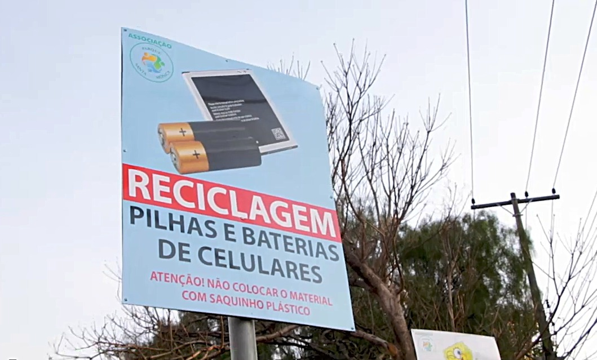

_Na sessão sobre o bairro foi mostrado o **valor dos resultados** das ações da associação, enquanto nessa página mostra-se o **valor do trabalho** e os custos envolvidos nas atividades para, com isso, fomentar a participação e o investimento financeiro de associados._

## Apresentação e principais conquistas{#apresentacao}
A Associação, presente no bairro desde 2003, ocupa-se do auxílio à manutenção e ações de melhoria no bairro visando aprimorar a qualidade de vida dos moradores.
O trabalho é feito de modo voluntário pelos associados, os quais atuam nos projetos de meio ambiente, manutenção, segurança e infraestrutura organizados na associação.
Além disso, visa unir forças para representar os interesses dos moradores junto ao poder público. Dentre suas conquistas estão:

* câmeras que aprimoraram a segurança do bairro;
* infraestrutura no entorno dos bosques, como iluminação e bancos, que modernizaram o bairro e provém mais uma opção de lazer; e
* pontos de coleta de lixo que favorecem a limpeza do bairro.

Atualmente cerca de 6 voluntarios desenvolvem os projetos e atividades -- venha ajudar para construirmos um bairro melhor!

[↥ _Retornar ao menu_](#logo)

## Como se associar{#associe-se}

Para se associar, por favor preencha a ficha abaixo e aguarde contato da associação para colher mais alguns dados e sua assinatura. Obrigado pelo interesse em se associar! Sua contribuição tornará o bairro melhor!

<form id="associar" action="" method="POST" target="_blank" ><input type="hidden" name="_language" value="pt-BR">

  <label>Nome:<input type="text" name="nome" style="width: 100%;"></label>
  <label>Rua da residência:<input type="text" name="nome" style="width: 100%;"></label>

  <label>E-mail:<input type="text" name="nome" style="width: 100%;"></label>
  <label>Telefone:<input type="text" name="nome" style="width: 100%;"></label>

 
  <button type="submit" style="margin-right: auto; margin-top: 0.5em; display: block;">Enviar</button>
</form>

[↥ _Retornar ao menu_](#logo)

## Atividades administrativas{#administracao}

* Participação no Conselho Municipal de Desenvolvimento Urbano (COMDUSC) e audiências públicas, interferindo quando os temas possam afetar o Bairro.
* Realização rotineira de audiências com Secretários, Vereadores, Prefeito, reivindicando benfeitorias, segurança e manutenção do Bairro
* Elaboração de ofícios à prefeitura e outros órgãos competentes.
* Reuniões da associação e suas comissões.
* Contato com prestadores de serviço.
* Elaboração e emissão de comunicados, assim como a atualização do site.
* Gestão financeira e pagamento de contas, como internet e luz das câmeras, prestadores de serviço e outros.

[↥ _Retornar ao menu_](#logo)

## Áreas de atuação{#atuacao}

A Associação executa atividades e projetos nos eixos:

* [ambiental](#ambiental);
* [infraestrutura e manutenção](#manutencao); e
* [segurança](#seguranca).

Veja detalhes abaixo.

### Atividades ambientais{#ambiental}

{ style="display: block; margin-left: auto; margin-right: auto; width: 70%;"  .responsive}

* Recolhimento do material dos pontos fixos de descarte consciente.
* Reposição de saquinhos de recolhimento de dejetos de pets.
* Contratação de jardineiro para poda no perímetro dos bosques e praças quando a solicitação não é atendida pela prefeitura.

[↥ _Retornar ao menu_](#logo)

### Atividades de infraestrutura e manutenção{#manutencao}

{ style="display: block; margin-left: auto; margin-right: auto; width: 70%;"  .responsive}

* Contratação de pintor para incluir nome das ruas nos postes.
* Solicitação junto à prefeitura de troca de lâmpada queimada.

[↥ _Retornar ao menu_](#logo)

### Atividades de segurança{#seguranca}

{ style="display: block; margin-left: auto; margin-right: auto; width: 50%;" .responsive}

* Projeto de posicionamento das câmeras de segurança.
* Contrato e supervisão com empresa prestadora de serviço da vigilância motorizada.
* Operação da câmeras.

[↥ _Retornar ao menu_](#logo)

## Estatuto e mesa diretora{#diretoria}

 
Estatuto e outros documentos

  <ul>
  <li><a href="./media/estatuto.pdf">Estatuto</a></li>
  <li><a href="./media/ficha-cadastro.pdf">Modelo da ficha de cadastro de associado</a></li>
  </ul>

:::{.table-diretoria}
-----------------------------------------
Mesa diretora        
-------------------- --------------------
Presidente           Rosely F. Pozzi

Vice-presidente      Francisco R. Andriolo

Tesoureira           Yvonne F. Sabe

Secretário           Claudio A. Policastro

Conselho             José G. Sabe

Conselho             Alex O. Azouri

Conselho             Luiz C. A. Fiorentino

Conselho (suplente)  Pedro A. Monteleone Filho
-----------------------------------------
:::

[↥ _Retornar ao menu_](#logo)
