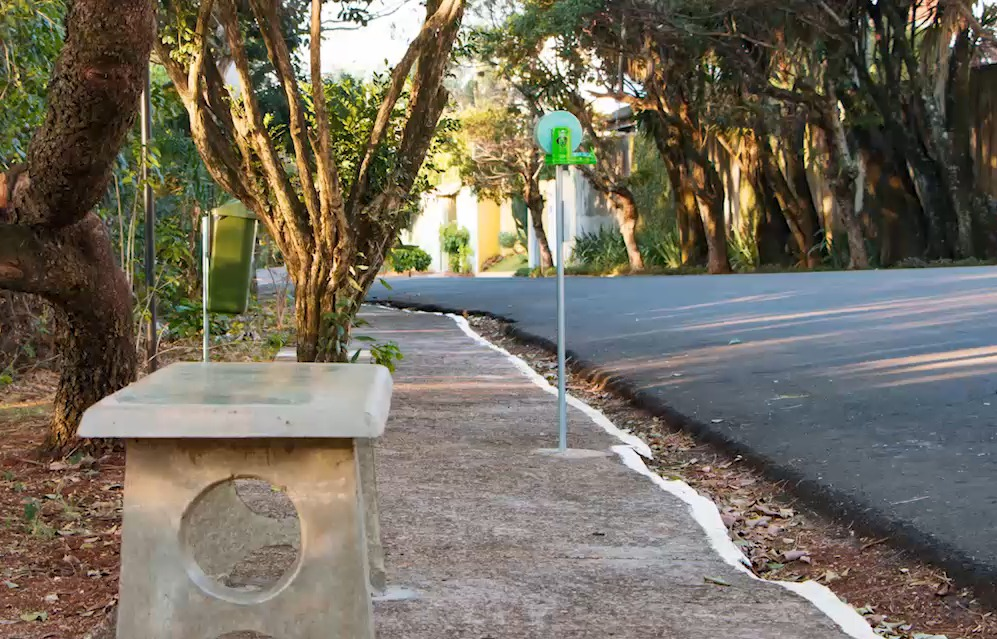

_Na sessão sobre o bairro foi mostrado o valor dos resultado das ações da associação, enquanto nessa página mostra-se o valor do trabalho dos associados e os custos envolvidos nas atividades para, com isso, fomentar a participação e o investimento financeiro de novos associados._

## Apresentação e principais conquistas{#apresentacao}
A Associação, presente no bairro desde meados de 2000, ocupa-se do auxílio à manutenção e ações de melhoria no bairro visando aprimorar a qualidade de vida dos moradores.
O trabalho é feito de modo voluntário pelos associados, os quais atuam nos projetos de meio ambiente, manutenção, segurança e infraestrutura organizados na associação.
Além disso, visa unir forças para representar os interesses dos moradores junto ao poder público. Suas principais conquistas desde a fundação são:

* câmeras que aprimoraram a segurança;
* infraestrutura no entorno dos bosques, como iluminação e bancos, que modernizaram o bairro e provém mais uma opção de lazer; e
* pontos de coleta de lixo que favorecem a limpeza do bairro.

Atualmente cerca de 6 voluntarios desenvolvem os projetos e atividades -- venha ajudar para construirmos um bairro melhor!

[↥ _Retornar ao menu_](#logo)

## Atividades ambientais{#ambiental}

{ style="display: block; margin-left: auto; margin-right: auto; width: 70%;" }

* Recolhimento do material dos pontos fixos de descarte consciente.
* Reposição de saquinhos de recolhimento de dejetos de pets.
* Contratação de jardineiro para poda no perímetro dos bosques e praças quando a solicitação não é atendida pela prefeitura.

[↥ _Retornar ao menu_](#logo)

## Atividades de infraestrutura e manutenção{#manutenção}

{ style="display: block; margin-left: auto; margin-right: auto; width: 70%;" }

* Contratação de pintor para incluir nome das ruas nos postes.
* Solicitação junto à prefeitura de troca de lâmpada queimada.

[↥ _Retornar ao menu_](#logo)

## Atividades de segurança{#segurança}

{ style="display: block; margin-left: auto; margin-right: auto; width: 50%;" }

* Projeto de posicionamento das câmeras de segurança.
* Contrato e supervisão com empresa prestadora de serviço da vigilância motorizada.
* Operação da câmeras.

[↥ _Retornar ao menu_](#logo)

## Atividades administrativas{#administração}

* Reuniões da associação e comissões.
* Pagamento dos custos mensais (internet e luz) das câmeras.
* Elaboração de ofícios à prefeitura e outros órgãos competentes.
* Contato com prestadores de serviço.
* Elaboração e emissão de comunicados
* Atualização do site.
* Gestão financeira.

[↥ _Retornar ao menu_](#logo)

## Documentos{#documentos}

 
Comunicados (ano 2022)

  <ol>
  <li><a href="./temp-images/202201-comunicado.pdf">Janeiro-n01</a></li>
  </ol>

 
Estatuto e outros

  <ul>
  <li><a href="./temp-images/ficha-cadastro.pdf">Ficha de associação</a></li>
  <li><a >Estatuto</a></li>
  <li><a >Prestação de contas - 2021Q1</a></li>
  </ul>

[↥ _Retornar ao menu_](#logo)

## Composição da diretoria{#diretoria}

--------------------- -----------
Presidente            Pessoa1
Vice-presidente       Pessoa2
Tesoureiro             
--------------------- -----------

[↥ _Retornar ao menu_](#logo)
