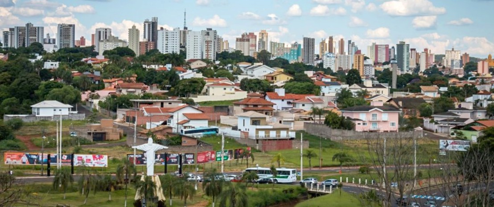

:::{.center}
## **Boas vindas ao bairro!**

<video controls
    src="media/institucional.mp4"
    poster="media/institucional-poster.jpeg">

Clique na imagem para fazer o download do vídeo institucional do bairro!
</video>

O **Parque Santa Mônica** é um bairro residencial **próximo ao centro** e cercado de atividades de **lazer**.
Conta com **bosques** que refrescam e embelezam a vizinhança, além de **ruas seguras e iluminadas**.
A Associação de Moradores do Parque Santa Mônica realiza atividades diversas em **benefício do bairro** e da **qualidade de vida** dos moradores, incluindo preservação, manutenção e representação de reinvidicações junto ao poder público.

**Participe e ajude a construir um bairro cada vez melhor!**

Para se associar, basta preencher a ficha ([clique aqui](./associacao-de-moradores.html#associe-se)).
:::

