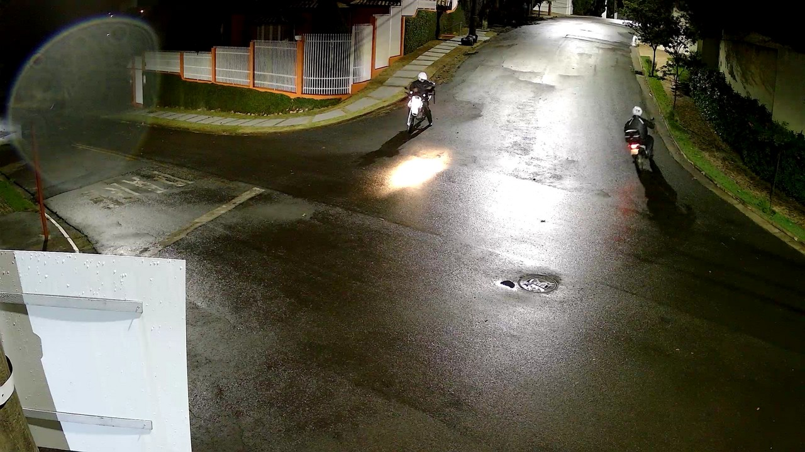

## Apresentação
Localizado próximo ao centro, SESC e Shopping, o bairro é composto de residências cercadas de ruas seguras e iluminadas, nas quais os moradores fazem atividades físicas e passeiam com seus pets.
Rodeado de bosques com uma flora exuberante que refresca e embeleza o bairro, além de promover a visita de visitantes ilustres da fauna como tucanos, andorinhas e teiús.
É um bairro que oferece uma qualidade de vida ímpar!

[↥ Retornar ao menu](#logo)

## Meio ambiente, infraestrutura e qualidade de vida{#meio-ambiente}
Bosques repletos de árvores cercam o bairro, melhorando a qualidade de vida e o microclima do bairro.
Também proporciona um local para que a fauna e flora convivam em harmonia com os moradores.
Há bancos de descanso e postes de iluminação no perimetro dos bosques.
As casas que compõem o bairro também possuem diversas áreas verdes em seus jardins e suas calçadas.

{ style="display: block; margin-left: auto; margin-right: auto; width: 50%;" }

<i class="fa fa-tree icon" style="color: darkolivegreen;"></i><i class="fa fa-battery-quarter icon fa-rotate-270" style="color: darkorange; font-size: 200%;"></i>

Para manter a limpeza do ambiente, há lixeiras e pontos de saquinho de coleta de dejetos de animais disponíveis no entorno dos bosques.
Há passagem de coleta seletiva e pontos fíxos de descarte consciente para esponja, pilhas e óleo de cozinha.
Com isso favorecendo a sustentabilidade e a limpeza das ruas do bairro.
Preservamos a natureza para possibilitar um futuro saudável aos nossos filhos e netos!

{ style="display: block; margin-left: auto; margin-right: auto; width: 70%;" }

<!--
<i class="fas fa-trash-alt icon" style="color: cornflowerblue;"></i>
-->

[↥ Retornar ao menu](#logo)

## Segurança e iluminação{#seguranca}
Aqui as ruas são seguras, pois são bem iluminadas e com ronda de vigilantes que auxiliam na entrada de residência, além de possuir câmeras de segurança de alta resolução ligadas 24h/dia.
Isso contribui para que esse bairro seja um dos mais seguros da cidade!

<i class="fas fa-camera icon"></i><i class="fas fa-motorcycle icon" style="color: firebrick; font-size: 275%;"></i><i class="fas fa-lightbulb icon" style="color: gold;"></i>

[↥ Retornar ao menu](#logo)

<!--## História, curiosidades, fotos e vídeos{#historia-e-midias}-->
<!--História do bairro; Números do bairro (área, população, qtde de casas); História do Cristo; Presença da nascente; Fotos antigas; Fotos da fauna e flora; Fotos da infraestrutura; Vídeos;-->

<!--[↥ Retornar ao menu](#logo)-->

## Mapa interativo

<iframe class="map" 
  frameborder="0" scrolling="no"
  marginheight="0" marginwidth="0"
  src="https://www.openstreetmap.org/export/embed.html?bbox=-47.915410995483406%2C-22.021442452415908%2C-47.900948524475105%2C-22.006164421081195&amp;layer=mapnik" >
  </iframe>

[↥ Retornar ao menu](#logo)
